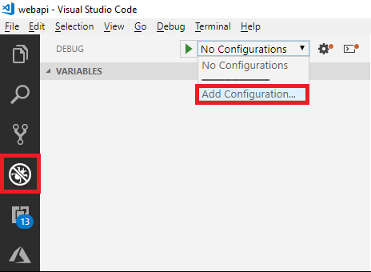

# Azure AD B2C: Java-based custom Azure AD B2C REST API

## Create Java project
Use [Spring initializer](https://start.spring.io/) to create Java application. Provide the Group name and Artifact. Under the dependencies select **Web**. Click **Generate Project** and download the zip file.

## Open the solution in VS Code
Unzip the file you download from [Spring initializer](https://start.spring.io/). Open your folder with VS Code. Click on **Debug** and from the menu select **Add Configuration**

If asked to select an environment, choose **Java**. From the created **launch.json** file, set the port number, e.g.,  8080 and run your project. You should see following error message because you don’t have a Controller to handle our HTTP requests.

## Add the Java code

Add following models:
- **B2CResponseModel.java** - this class represents the output JSON data sends back to Azure AD B2C
- **B2CResponseError.java** inherits from B2CResponseModel.java while adding constructor that initiates an error
- **B2CResponseError.java** inherits from B2CResponseModel.java while adding constructor that initiates JSON response

Add the Identity controller **IdentityController.java**. The Controller handles the incoming HTTP requests from Azure AD B2C. 
