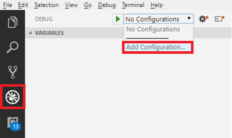

# Azure AD B2C: Node.js express based custom Azure AD B2C REST API

1. Installed [Node.js](https://nodejs.org/). If you aleardy install Node.js move to the next step

1. Create a working directory to hold your application

1. Open your working folder with VS Code

1. Run the `npm init` command. This command creates a **package.json** file for your application. The command prompts you to provide some information regarding your application, such as the name and version of your application. Accept all the default values. Make sure the **entry point** is set to `app.js`. 

1. Install following NPM packages: [express](https://www.npmjs.com/package/express) [body-parser](https://www.npmjs.com/package/body-parser)
    ```
    npm install express --save
    npm install body-parser
    ```

1. Copy the **app.js** file to your working folder

1. To run your Node.js app using VS Code debugger, click on **Debug** and from the menu select **Add Configuration** and click **Run**

    

1. Before you deploy your solution and use it with Azure AD B2C, try to make a direct call to your REST API endpoint, using api client tool such as [Postman](https://www.getpostman.com/)
    - Run following POST request to your endpoint. This call should return a JSON with a random loyalty number.

    ```HTTP
    POST http://localhost:3000/api/identity/loyalty
    {
        "language": "1033",
        "objectId": "0f8fad5b-d9cb-469f-a165-70867728950e",
    }
    ```
    - Run following POST request to your endpoint. This call will throw 409 HTTP error message. Change the email from `TEST@contoso.com` to `someone@contoso.com`. Now, the REST API will return a random loyalty number and the email address in lower case.
        
    ```HTTP
    POST http://localhost:3000/api/identity/validate
    {
        "language": "1033",
        "email": "TEST@contoso.com"
    }
    ```
    
## Solution artifacts
- [app.js](app.js) The REST API endpoint
- [package.json](package.json) Lists the packages that the project depends on


